<style>
img{
    width: 60%;
    padding-left: 20%;
}
</style>

# Mamba: 从 入门 到 入土

## 内容概要
1. 背景介绍
2. 什么是 SSM
3. Mamba
4. VMamba

## 背景介绍

### Transformer
将在大量数据上预训练好的 基础模型 （Foundation models） 或者 大模型 （Large models）自适应到下游任务上已经成为了现代机器学习的一个非常有效的范式。

这些模型的骨干网络一般是 序列模型 （sequence models），以便能够操作来自各种不同领域的任意序列输入，例如 语言、图像、语音、音频、时间序列和基因组学。

尽管上面这些领域的概念与模型架构的选择没有必然联系，但现代的 FMs 主要基于单一类型的序列模型：transformer 或者说 其核心 attention layer。

回顾一下 attention 机制：

给定两个序列 $X \in \mathbb{R}^{L_x \times d_x}，Y \in \mathbb{R}^{L_y \times d_y}$，矩阵 $W_q \in \mathbb{R}^{d_x \times d}, W_k \in \mathbb{R}^{d_y \times d}, W_v \in \mathbb{R}^{d_y \times d_v}$。
首先将两个序列进行线性映射 $Q = XW_q \in \mathbb{R}^{L_x \times d}, K = YW_k \in \mathbb{R}^{L_y \times d}, V = YW_v \in \mathbb{R}^{L_y \times d_v}$。
计算attention map $\mathcal{S}$:
$$
\begin{equation}
\mathcal{S} = Softmax(\frac{QK^\top}{\sqrt{d}}, dim=1)\in \mathbb{R}^{L_x\times L_y}.
\end{equation}
$$
计算输出 $O$:
$$
\begin{equation}
O=\mathcal{S}V \in \mathbb{R}^{L_x\times d_v}.
\end{equation}
$$

在 self-attention 中，两个序列相等，即 $X=Y$ 并且一般 $d_x = d_v$。
对于不同的输入序列，self-attention 总能根据序列的内容完成 token 之间的信息交互，这赋予其强大的建模能力。

举一个具体的例子来看看这种方式的优势，和劣势：GPT生成文本，其结构是堆叠在一起的transformer decoder block，如下图所示：

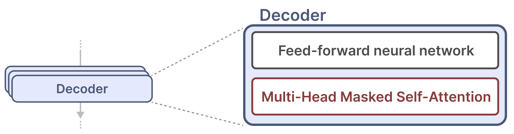

其中的 Masked Self-Attention 的具体做法是将公式 (1) 中的 $\mathcal{S}$ 的上三角部分做掩码处理（应该是在 softmax 之前直接将对应元素变 负无穷），如下图：

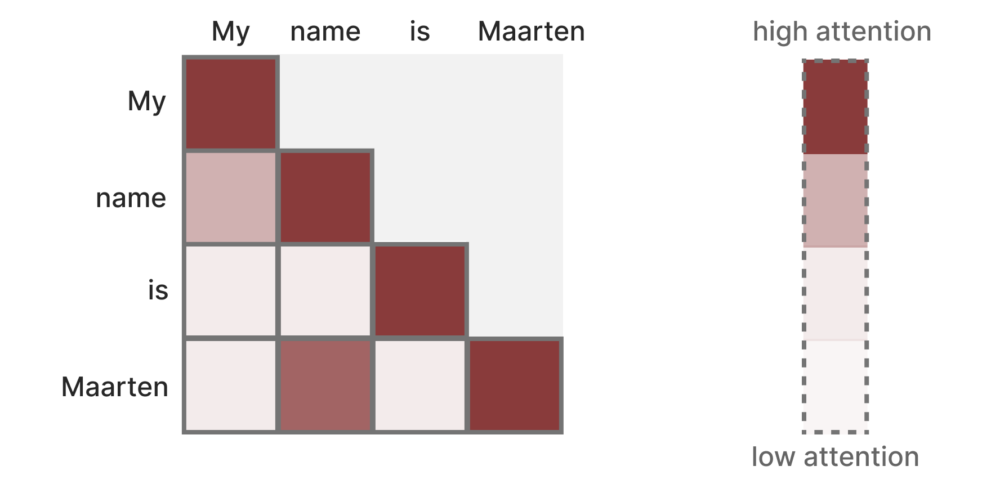

有啥优势呢？
1. token 之间可以自适应的与上文进行交互。
2. 由于 Masked Self-Attention 的存在，可以将一个长度为 N 的序列喂入之后，直接给出 对应的 N 个预测 $p(u_{i+1}|u_{i},...,u_1;\theta)$，这使得训练可以并行化。

有啥劣势呢？先看看做预测的时候，GPT怎么运作的：


其采用的是一种 auto-regressive 的方式进行预测，每预测出一个词，都会将其添加至下一次的输入中，这将带来两个问题：
1. 串行预测，速度较慢（可以忍受，能解决最好，但是一般来说 auto-regressive 都是串行预测的）。
2. 随着序列长度的增加，attention 的资源开销将会以平方形式增加（无法接受，买不起 A100）。

并且在有些任务中，我们甚至会假设序列的最大长度已知，这将会使得超出序列长度的输出性能大大下降（例如ViT，甚至是固定输入序列的长度）。

有没有什么解决方案？

### RNN
循环神经网络（RNN）是一种基于序列的网络。
它在序列的每个时间步取两个输入，即时间步 t 的输入和前一个时间步 t-1 的隐藏状态，以生成下一个隐藏状态并预测输出。

RNN 有一个循环机制，允许它们将信息从上一步传递到下一步。我们可以展开这个可视化，使它更明确，如下图：

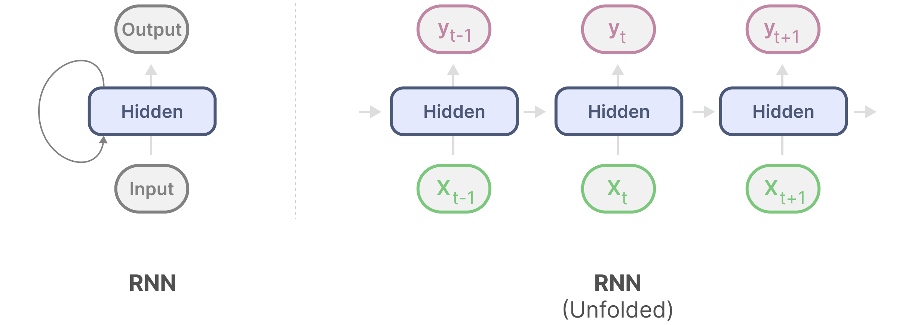

不难发现，随着序列长度的增加，计算资源开销只会呈现线性增长！
但是，由于只能串行的输出每个时间步的预测，训练也变串行了。

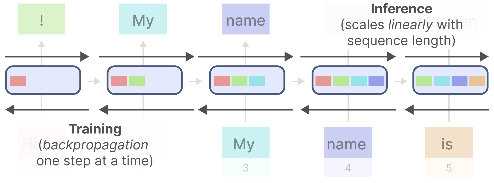

哦吼，RNN 和 transformer 优势劣势完全对立啊：

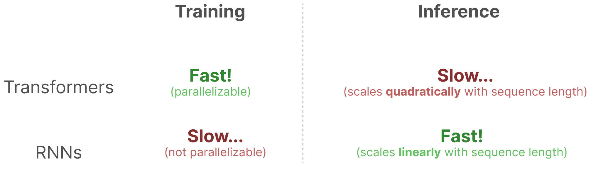

**CNN 行不行？**

利用一个卷积核，聚合窗口之内的上下文，给出当前时间步 t 的预测。
这确实做到的在训练时可以并行，测试时计算资源线性增长。

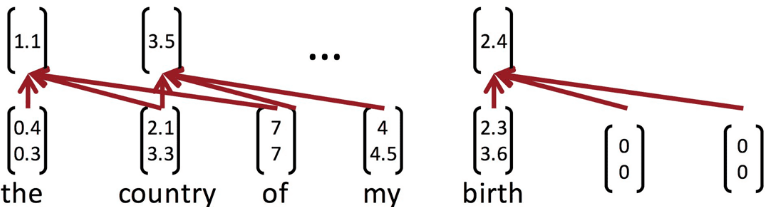

不过窗口大小固定，能够结合的上下文信息有限，在序列长度较大的场景下，甚至根本无法获取到更早期的上下文。

## SSM
### 什么是 State Space ？
状态空间（State Space），是控制工程中的一个名词。状态是指在系统中可决定系统状态、最小数目变量的有序集合。
而所谓状态空间则是指该系统全部可能状态的集合。
简单来说，状态空间可以视为一个以状态变量为坐标轴的空间，因此系统的状态可以表示为此空间中的一个向量。
<!-- 选取怎样的状态，将会决定状态空间，以及状态之间随时间如何转换。 -->

看个例子：

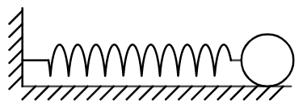

一个简单的弹簧小球模型，假设小球质量为 $m$，弹簧弹性系数为 $k$，弹簧未形变时假设小球坐标位置为 $0$，给定 小球初始位置 $x_0$，初始速度 $v_0$。给定任意时刻 $t$ 小球所受到的外力 $f(t)$，小球任意时刻的位移 $x(t)$ 是确定的。

我们可以以小球当前位置 $x(t)$，当前速度 $v(t)$ 作为系统状态，可以表示为 
$$
\begin{equation}
{s} = \left[
    \begin{align}
    x(t) \nonumber \\
    v(t) \nonumber
    \end{align}
\right]
\end{equation}
$$
系统的状态空间则是 $s$ 所有可能的集合，如果不考虑物理限制（弹簧形变长度限制，相对论效应），$s\in \mathbb{R}^2$。

### 什么是 State Space Model ？
状态空间模型（State Space Model）是建立在状态空间概念基础之上的具体数学模型。
它由状态方程和观测方程组成，用于描述动态系统的行为。
状态空间模型提供了一种形式化的方法来表示系统的动态行为，包括系统状态随时间的演变（状态方程）以及系统状态与观测之间的关系（观测方程）。
具体形式如下：
$$
\begin{align}
\text{State equation:}\quad \dot{x} &= A x + B u \\
\text{Output equation:}\quad o &= C x + D u
\end{align}
$$
其中 $A,B,C,D$ 的值由系统的性质决定，$u$ 是系统输入，$o$ 是输出，$x$ 是状态，$\dot{x}$ 是状态关于时间 $t$ 的导数。
给定一个初始状态 $x(t_0)$，以及之后的系统输入 $u(t)$，通过上面的方程，我们可以计算接下来任意时间 $t$ 的系统输出。（怎么算，后面再说）

回顾上面的弹簧小球系统，可以列出以下方程（只考虑弹簧弹力和外力 $f$）：
$$
ma(t) = f - kx(t), a(t) = \ddot{x} (t).
$$
整理可以得到：
$$
\begin{equation}
\dot{s} 
= 
\left[
    \begin{align}
    v(t) \nonumber \\
    a(t) \nonumber
    \end{align}
\right]
=
\left[
    \begin{align}
    0 \quad & 1 \nonumber \\
    -\frac{k}{m} \quad & 0 \nonumber \\
    \end{align}
\right]
\left[
    \begin{align}
    x(t) \nonumber \\
    v(t) \nonumber
    \end{align}
\right]
+
\left[
    \begin{align}
    0 \nonumber \\
    \frac{1}{m} \nonumber
    \end{align}
\right][f(t)]
\end{equation}
$$
$$
\begin{equation}
% \dot{X} 
% = 
[x(t)]
=
\left[
    1 \quad 0 \nonumber
\right]
\left[
    \begin{align}
    x(t) \nonumber \\
    v(t) \nonumber
    \end{align}
\right]
\end{equation}
$$

即 
$$
A = \left[
    \begin{align}
    0 \quad & 1 \nonumber \\
    -\frac{k}{m} \quad & 0 \nonumber \\
    \end{align}
\right],
B = \left[
    \begin{align}
    0 \nonumber \\
    \frac{1}{m} \nonumber
    \end{align}
\right],
C = [1 \quad 0], D = 0.
$$

### 如何求解 SSM ？
来自某本 系统控制理论 的书：
线性定常系统在控制 $u(t)$ 下运动，其状态方程为：
$$
\begin{align}
\dot{x} &= A x + B u 
\end{align}
$$
当初始时刻为 $t_0$，其初始状态为 $x_0$ 时，其解为：
$$
x(t) = \Phi(t - t_0)x(t_0)+\int_{t_0}^t \Phi(t - \tau)Bu(\tau)\text{d}\tau,
$$
其中 $\Phi(t)=e^{At}=\sum_{k=0}^{\infty}\frac{(At)^k}{k!}=1 + At + \frac{(At)^2}{2!}+\cdots$.

证明：

移项， 
$$\dot{x}-Ax = Bu,$$
两边同乘 $e^{-At}$，
$$e^{-At}[\dot{x}-Ax]=e^{-At}Bu,$$
即，
$$\frac{\text{d}}{\text{d}t}[e^{-At}x]=e^{-At}Bu,$$
从 $t_0$ 到 $t$ 积分，
$$e^{-At}x(t)|_{t_0}^t=\int_{t_0}^te^{-A\tau}Bu(\tau)\text{d}\tau,$$
整理，
$$
\begin{equation}
x(t) = e^{A(t-t_0)}x(t_0) + \int_{t_0}^te^{A(t - \tau)}Bu(\tau)\text{d}\tau
\end{equation}
$$

通过公式 (6)，以及输出方程，可以计算系统任意时刻的输出。

### SSM for sequence modeling
将 SSM 用于序列建模是非常直觉的，其天然的接受一个 输入序列，得到一个 输出序列，如图（由于ML一般输入用 $x$ 表示， 输出用 $y$ 表示，所以这里符号稍有变化，用 $h$ 表示状态）：
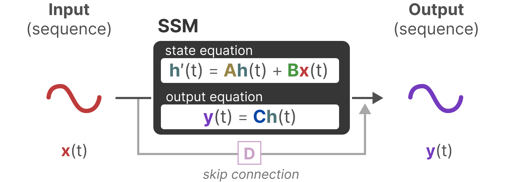

然而还存在一个问题是：上面的 SSM 是连续的，对于连续信号来说，处理上面的 SSM 非常 analytically challenging。 另外对于例如语言这种离散序列，显然不能直接使用上述 SSM。

我们当然希望有一个离散化的 SSM ，并且其与 连续形式 有相同或者类似的表达式：
$$
\begin{align}
h_{k+1} =& \bar{A} h_k + \bar{B} x_k \\
y_{k+1} =& \bar{C} h_{k+1}
\end{align}
$$

为了应对这个问题，我们需要将 SSM 离散化，如果是一个连续信号，我们首先要对齐进行采样，如图

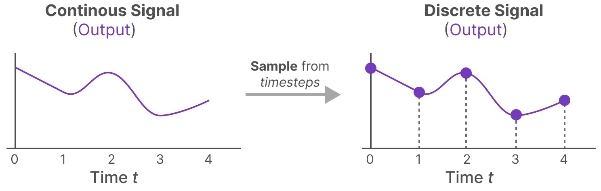

如果是离散序列，不需要处理。

接下来就是计算对应的离散化的 SSM 公式。
考虑两个相邻的采样时间步 $t$ 和 $t + \Delta$，根据上面的 SSM 的求解公式有
$$
\begin{align}
h(t+\Delta) = e^{A\Delta}h(t) + \int_{t}^{t+\Delta}e^{A(t + \Delta - \tau)}Bx(\tau)\text{d}\tau
\end{align}
$$

对于连续数据我们可以强行计算后面的积分项，但是对于离散数据呢？
并且强行计算积分项那完全没必要离散化。
这里我们采用一种叫做 Zero-order hold 的技术，其作用是在区间 $[t, t+\Delta)$ 内，保持输入为 $x(\tau) = x(t)$，图示如下：
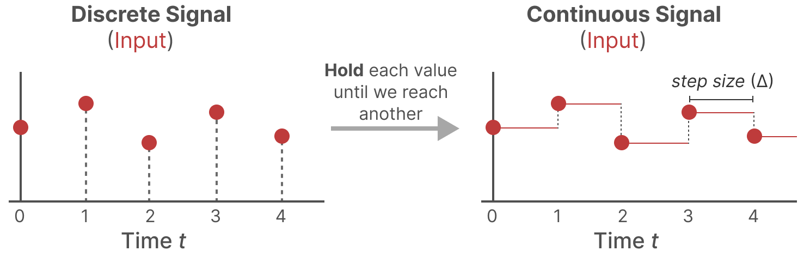

公式（7）可计算为：
$$
\begin{align}
h(t+\Delta) &= e^{\Delta A}h(t) + (-A)^{-1}e^{A(t + \Delta - \tau)}Bx(t)|_{t}^{t+\Delta} \\
&= e^{\Delta A}h(t) + (\Delta A)^{-1}[e^{\Delta A} - I](\Delta B)x(t)
\end{align}
$$

采用离散的方式进行表示：
$$
h_{k+1} = e^{\Delta A} h_k + (\Delta A)^{-1}[e^{\Delta A} - I](\Delta B) x_k, \quad y_{k+1} = C h_{k+1},
$$
于是离散化的参数可以这样计算：
$$
\bar{A} = e^{\Delta A}, \bar{B} = (\Delta A)^{-1}[e^{\Delta A} - I](\Delta B), \bar{C} = C.
$$
当然有些工作进一步将这个式子用一阶泰勒展开近似，他们将离散化计算为：
$$
\bar{A} = [I-\frac{\Delta}{2}A]^{-1}[I+\frac{\Delta}{2}A], \bar{B} = \Delta [I-\frac{\Delta}{2}A]^{-1} B, \bar{C} = C.
$$

于是我们完成了对 SSM 的离散化，

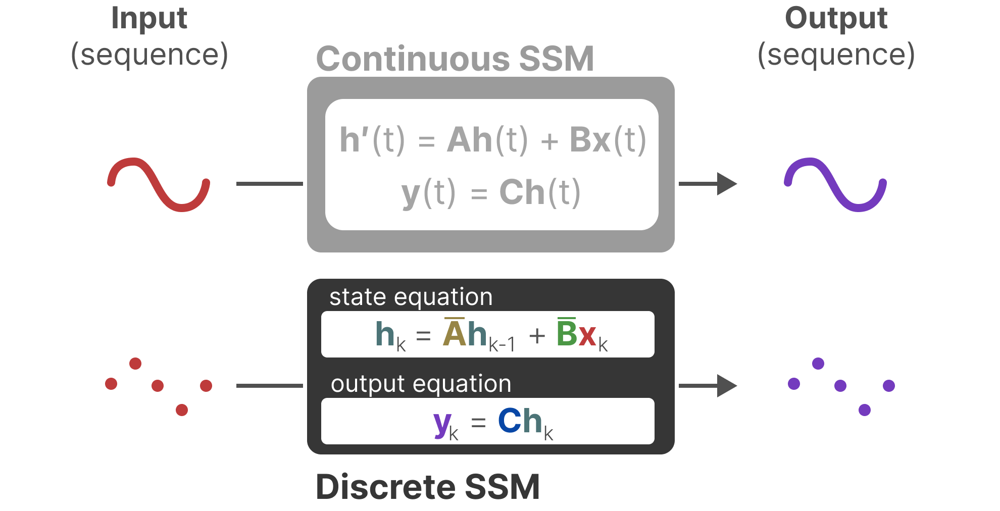

值得注意的一点是，上图的公式和公式（7）（8）貌似没对上，实际上我们只需要在推导公式（10）的时候将 零阶保持 修改为：$\tau \in (t, t+\Delta]$ 时 $x(\tau) = x(t+\Delta)$ 即可得到完全一致的表达式。

### SSM 的 Recurrent 表示
给定一个离散的输入序列 $x_k$，离散化 SSM 和最开始的 RNN 几乎一模一样：每个时刻将隐变量和输入喂入，得到当前时刻的输出，即
$$
h_{k} = \bar{A} h_{k-1} + \bar{B} x_{k}, y_k = \bar{C} h_{k}
$$
我们先看看具体的计算过程，
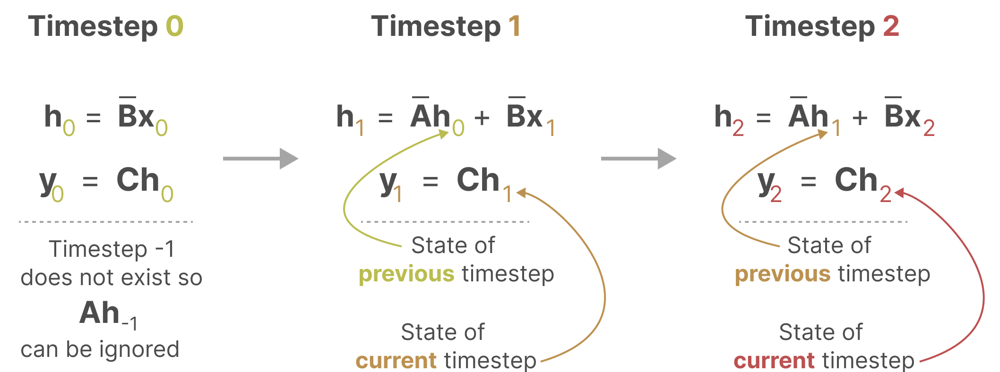
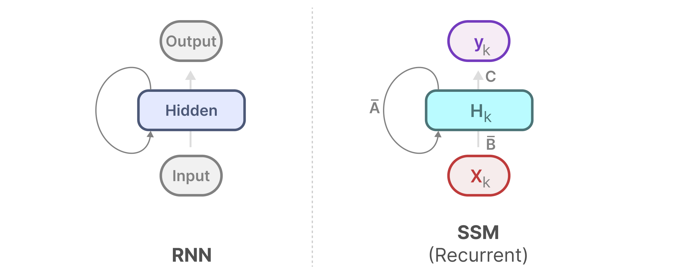
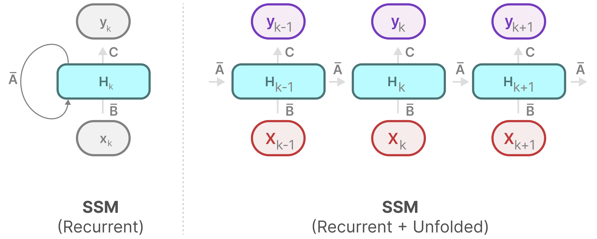

这将给 SSM 带来 RNN 的 好/坏 性质：线性扩增性，无法并行训练。

### SSM 的 Convolution 表示
将 $y_k$ 展开（$\bar{C} = C$ 就不赘述了）：
$$
\begin{align}
y_k &= C h_k \nonumber \\
&= C(\bar{A} h_{k-1} + \bar{B} x_k) = C\bar{A} h_{k-1} + C\bar{B} x_k \nonumber \\
&= C\bar{A} (\bar{A}h_{k-2} + \bar{B}x_{k-1}) + C\bar{B} x_k = C\bar{A}^2 h_{k-2} + \sum_{i=0}^{1} C  \bar{A}^{i}\bar{B} x_{k-i} \nonumber \\
&= C\bar{A}^{k+1} h_{-1} + \sum_{i=0}^{k} C  \bar{A}^{i}\bar{B} x_{k-i} \nonumber \\
&= \sum_{i=0}^{k} C  \bar{A}^{i}\bar{B} x_{k-i}
\end{align}
$$

记 
$$
K = (C\bar{B}, C\bar{A}\bar{B},\cdots,C\bar{A}^{k}\bar{B},\cdots) \\
x = (x_0, x_1, \cdots, x_k, \cdots)
$$
输出 $y$ 可以用卷积形式表示：
$$y = x \star K$$

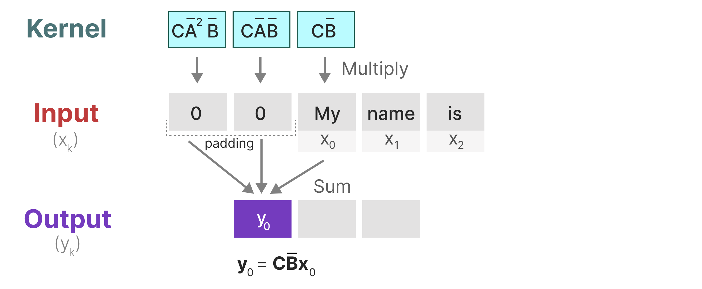
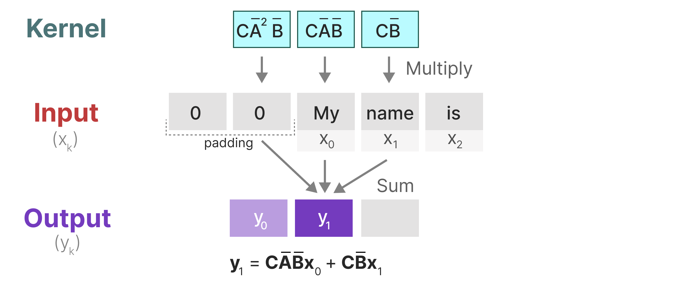
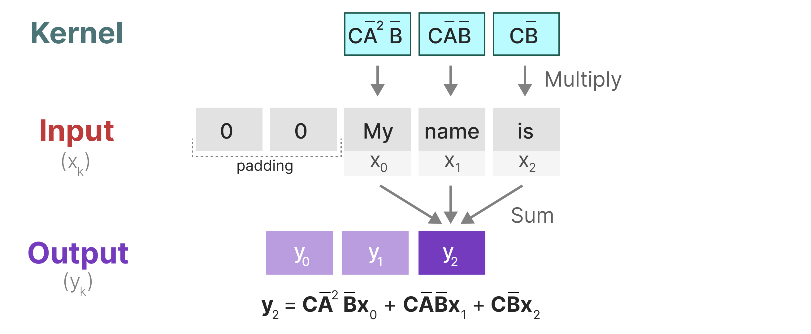

将SSM表示为卷积的一个主要好处是它可以像卷积神经网络(cnn)一样并行训练。然而，由于核大小固定，它们的推理不如rnn快速和无界。

### SSM 示例
Don't talk. Show your code.

```python
import torch
from matplotlib import pyplot as plt

def discretize(A: torch.Tensor, B: torch.Tensor, C: torch.Tensor, dt: float):
    # A: [N, N], B: [N, 1] or [N, D], C: [1, N] or [D, N], dt: float
    N = A.shape[0]
    I = torch.eye(N)
    inv_tmp = torch.linalg.inv(I - dt / 2 * A)
    barA = inv_tmp @ (I + dt / 2 * A)
    barB = inv_tmp @ (dt * B)
    barC = C
    return barA, barB, barC

def scan_SSM(barA: torch.Tensor, barB: torch.Tensor, barC: torch.Tensor, u: torch.Tensor, x0: torch.Tensor):
    # barA: [N, N], barB: [N, 1] or [N, D], barC: [1, N] or [D, N]
    # u: [L, 1] or [L, D], x0: [N, 1]
    def step(x_k_1, u_k):
        x_k = barA @ x_k_1 + barB @ u_k
        y_k = barC @ x_k
        return x_k, y_k

    output_list = []
    u_list = torch.split(u, 1, dim=0)
    s_k = x0  # state_0

    for u_k in u_list:
        s_k, o_k = step(s_k, u_k.T)  # u_k is [1, 1] or [1, D], D shoule be the first dim
        output_list.append(o_k)

    return s_k, output_list

def run_SSM(A: torch.Tensor, B: torch.Tensor, C: torch.Tensor, u: torch.Tensor, x0=None, dt=None):
    L = u.shape[0]
    N = A.shape[0]
    if dt is None:
        dt = 1.0 / L
    barA, barB, barC = discretize(A, B, C, dt=dt)
    if x0 is None:
        x0 = torch.zeros((N, 1))
    if u.ndim == 1:
        u = u.unsqueeze(dim=-1)

    return scan_SSM(barA, barB, barC, u, x0)

def example_mass1(k, m):
    A = torch.tensor([[0, 1], [-k / m, 0]])
    B = torch.tensor([[0], [1.0 / m]])
    C = torch.tensor([[1.0, 0]])
    return A, B, C

def zero_force(t):
    x = torch.zeros_like(t)
    return x


if __name__ == "__main__":
    ssm = example_mass1(k=40, m=1)

    # Time split
    L = 100
    step = 1.0 / L
    ks = torch.arange(L * 2)  # 2 * L samples of u(t).
    u = zero_force(ks * step)

    # Approximation of y(t).
    s, y = run_SSM(*ssm, u, torch.tensor([[10.0], [0.0]]), step)
    y = [item.item() for item in y]

    plt.plot(y)
```
*example_mass1* 函数构造了前面弹簧小球系统的 SSM ，假设将小球在 $x_0 = 10$ 处静止释放，并且接下来不受到任何外力，即 $f(t) = 0$，这将是一个简单的简谐运动系统。运行上述代码验证，结果如下，符合实际：

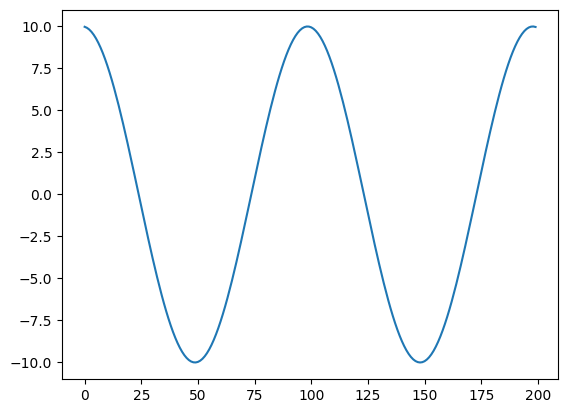

### SSM 小结
SSM 连续的、循环的和卷积的这三种表示都有不同的优缺点


有趣的是，我们现在可以使用循环SSM进行了高效的推理，并且可以使用卷积SSM进行了并行化训练。
这看起来简直完美解决了最开始的问题。

**但是**，这些表示都有一个重要的特性，即线性时不变性(LTI)。
LTI 要求 SSM 参数 A、B 和 C 对于所有时间步都是固定的。
这意味着对于 SSM 处理的每个 token，矩阵 A、B 和 C 都是相同的。

换句话说，无论给 SSM 的序列是什么，A、B 和 C 的值都保持不变。
这是一个内容不铭感的静态表示。

插一句题外话，如果想知道如何选择 A 的形式，使得其能够得到超长序列的记忆，以及快速计算卷积核 $K$，请参考论文 Structured State Space for Sequences (s4)。

### Mamba - A Selective SSM
<!-- 大概可以表示为下图：
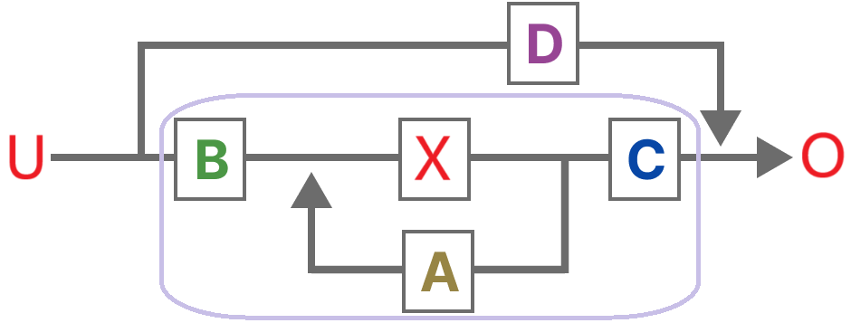 -->