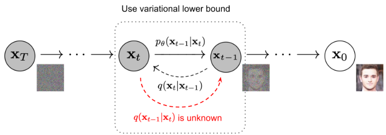

# Diffusion models (扩散模型)

## TO Read
- 随机梯度Langevin动力学
- VAE
- Energy model

## 什么是扩散模型
扩散模型的灵感来自非平衡热力学。他们定义了扩散步骤的马尔可夫链，以缓慢地将随机噪声添加到数据中，然后学习反转扩散过程以从噪声构建所需的数据样本。

## 前向扩散过程 (Forward diffusion process)
给定一个数据点$x_0 \sim q(x_0)$, 前向过程被定义为逐步（总共T步）向样本添加少量高斯噪声，产生一系列的噪声样本$x_1, x_2, \cdots, x_T$。步长由方差控制$\{\beta_t\in(0,1)\}_{t=1}^T$，其中有$0<\beta_1<\beta_2<\cdots<\beta_T<1$。

第$t$时刻的前向过程被定义为：
$$
x_t = \sqrt{1-\beta_t} x_{t-1} + \sqrt{\beta_t}\epsilon_{t-1}, \epsilon_{t-1}\sim\mathcal{N}(0, \mathbf{I}). 
$$
由于$\epsilon_{t-1}\sim\mathcal{N}(0, \mathbf{I})$，所以给定$x_{t-1}$，$x_{t}$的条件分布可以表示为：
$$
q(x_{t}|x_{t-1}) = \mathcal{N}(x_t;\sqrt{1-\beta_t}x_{t-1}, \beta_t\mathbf{I}).
$$
根据马尔可夫链（Markov chain）的性质，给定$x_0$，$x_{1:T}$的分布可以表示为：
$$
q(x_{1:t}|x_0) =  \Pi_{t=1}^T q(x_t | x_{t-1}). 
$$

给定任意$t\ge1$，$x_t$可以通过以下方式计算，（记 $\alpha_t = 1 - \beta_t, \bar{\alpha}_t = \Pi_{i=1}^t \alpha_i$）：
$$
\begin{align}
x_t &= \sqrt{1-\beta_t} x_{t-1} + \sqrt{\beta_t}\epsilon \nonumber \\
&=\sqrt{\alpha_t} x_{t-1} + \sqrt{1-\alpha_t}\epsilon_{t-1} \nonumber \\
&=\sqrt{\alpha_t} (\sqrt{\alpha_{t-1}} x_{t-2} + \sqrt{1-\alpha_{t-1}}\epsilon_{t-2}) + \sqrt{1-\alpha_t}\epsilon_{t-1} \nonumber \\
&= \sqrt{\alpha_{t}\alpha_{t-1}} x_{t-2} + \sqrt{\alpha_{t}(1-\alpha_{t-1})}\epsilon_{t-2} + \sqrt{1-\alpha_t}\epsilon_{t-1} \nonumber \\
&=\sqrt{\alpha_{t}\alpha_{t-1}} x_{t-2} + \sqrt{1-\alpha_t\alpha_{t-1}}\bar{\epsilon}_{t-2} & \divideontimes \nonumber \\
&=\sqrt{\alpha_{t}\alpha_{t-1}} (\sqrt{\alpha_{t-2}} x_{t-3} + \sqrt{1-\alpha_{t-2}}\epsilon_{t-3}) + \sqrt{1-\alpha_t\alpha_{t-1}}\bar{\epsilon}_{t-2} \nonumber \\
&=\sqrt{\alpha_{t}\alpha_{t-1}\alpha_{t-2}}  x_{t-3} + \sqrt{\alpha_{t}\alpha_{t-1}(1-\alpha_{t-2})}\epsilon_{t-3} + \sqrt{1-\alpha_t\alpha_{t-1}}\bar{\epsilon}_{t-2} \nonumber \\
&=\sqrt{\alpha_{t}\alpha_{t-1}\alpha_{t-2}}  x_{t-3} + \sqrt{1-\alpha_t\alpha_{t-1}\alpha_{t-2}}\bar{\epsilon}_{t-3} & \divideontimes \nonumber \\
& = \cdots \nonumber \\
& = \sqrt{\bar{\alpha_{t}}} x_0 + \sqrt{1-\bar{\alpha_{t}}}\epsilon \nonumber \\
\Longleftrightarrow & \quad p(x_t|x_0) = \mathcal{N}(x_t;\sqrt{\bar{\alpha}_t}x_0, (1-\bar{\alpha}_t)\mathbf{I})
\end{align}
$$
其中的$\divideontimes$表示的是高斯噪声的合并：
$$\mathcal{N}(0,\sigma_1^2\mathbf{I}) + \mathcal{N}(0,\sigma_2^2\mathbf{I}) = \mathcal{N}(0,(\sigma_1^2 + \sigma_2^2)\mathbf{I}). $$
通常当样本变得更嘈杂时，可以添加的噪声也变得更大，于是有前面提到的$0<\beta_1<\beta_2<\cdots<\beta_T<1$，同时有$1>\bar{\alpha}_1>\bar{\alpha}_2>\cdots>\bar{\alpha}_T>0$。可以看到，只要加噪声步数足够多$T\to\infty$，有$\bar{\alpha}_T\to0$，也就是最终得到的是一个标准高斯噪声。

## 逆扩散过程 （Reverse diffusion process）
如果我们可以将前向过程反转，从$q(x_{t-1}|x_t)$中逐步采样，那么我们就可以将一个给定的高斯噪声$x_t\in \mathcal{N}(0,\mathbf{I})$还原成真实样本。（假设$\beta_t$足够小时，$q(x_{t-1}|x_t)$也会是一个高斯分布。）但是估计$q(x_{t-1}|x_t)$需要整个数据集，这是不容易的。于是转而去学习一个模型$p_\theta$能够近似这些条件概率，以便可以完成反向过程：
$$
p_{\theta}(x_{0:T}) = p(x_t)\Pi_{t=1}^T p_{\theta}(x_{t-1}|x_t)
$$
如果将反向过程看作是一个高斯过程，那么有
$$
\begin{align}
p_{\theta}(x_{t-1}|x_t) = \mathcal{N}(x_{t-1};\mu_\theta(x_t, t),\Sigma_\theta(x_t, t)) \nonumber
\end{align}
$$
那么优化目标是什么呢？或者说如何训练呢？这里使用常用的极大似然估计法，也称之为最小化负对数似然（记$z=x_{1:T},x=x_0$）：
$$
\begin{align}
\mathbb{E}_{x\sim q(x)}[-\log p_\theta(x)] &= \int_x q(x)[-\log p_\theta(x)] dx \nonumber \\
&= \int_x \int_z q(x, z) dz [-\log p_\theta(x)] dx \nonumber \\
% &= \int_x q(x) \int_z q(z|x)[-\log p_\theta(x)] dz dx \nonumber \\
&= \mathbb{E}_{x,z\sim q(x,z)}[-\log p_\theta(x)] \nonumber \\
&= \mathbb{E}_{x,z\sim q(x,z)}[-\log \frac{p_\theta(x, z)}{p_\theta(z | x)}] \nonumber \\
&= \mathbb{E}_{x,z\sim q(x,z)}[-\log \frac{p_\theta(x, z)}{q(z | x)}\frac{q(z|x)}{p_\theta(z|x)}] \nonumber \\
&= \mathbb{E}_{x,z\sim q(x,z)}[-\log \frac{p_\theta(x, z)}{q(z | x)}] - \mathbb{E}_{x,z\sim q(x,z)}[\log \frac{q(z|x)}{p_\theta(z|x)}]\nonumber \\
&= \mathbb{E}_{x,z\sim q(x,z)}[-\log \frac{p_\theta(x, z)}{q(z | x)}] - \mathbb{E}_{x\sim q(x)}[KL(q(z|x)||p_\theta(z|x))]\nonumber \\
& \le  \mathbb{E}_{x,z\sim q(x,z)}[-\log \frac{p_\theta(x, z)}{q(z | x)}]\nonumber
\end{align}
$$
优化右边的上界(从变分法看，应该有什么理论证明)，先变换变换 
$$
\begin{align}
&\mathbb{E}_{x,z\sim q(x,z)}[-\log \frac{p_\theta(x, z)}{q(z | x)}] = \mathbb{E}_{x_{0:T}}[-\log \frac{p_\theta(x_{0:T})}{q(x_{1:T}| x_0)}]\nonumber \\
&=\mathbb{E}_{x_{0:T}}[-\log \frac{p(x_t)\Pi_{t=1}^T p_{\theta}(x_{t-1}|x_t)}{\Pi_{t=1}^T q(x_t | x_{t-1})}]\nonumber \\
&=\mathbb{E}_{x_{0:T}}[-\log p(x_t) -\sum_{t=1}^T \log \frac{p_{\theta}(x_{t-1}|x_t)}{q(x_t | x_{t-1})}]\nonumber \\
&=\mathbb{E}_{x_{0:T}}[-\log p(x_t) -\sum_{t=2}^T \log \frac{p_{\theta}(x_{t-1}|x_t)}{q(x_t | x_{t-1}, x_0)}-\log \frac{p_\theta(x_0|x_1)}{q(x_1|x_0)}]\nonumber \\
&=\mathbb{E}_{x_{0:T}}[-\log p(x_t) -\sum_{t=2}^T \log \frac{p_{\theta}(x_{t-1}|x_t) q(x_{t-1}, x_0)}{q(x_t , x_{t-1}, x_0)}-\log \frac{p_\theta(x_0|x_1)}{q(x_1|x_0)}]\nonumber \\
&=\mathbb{E}_{x_{0:T}}[-\log p(x_t) -\sum_{t=2}^T \log \frac{p_{\theta}(x_{t-1}|x_t) q(x_{t-1}, x_0)}{q(x_{t-1} | x_{t}, x_0) q(x_t, x_0)}-\log \frac{p_\theta(x_0|x_1)}{q(x_1|x_0)}]\nonumber \\
&=\mathbb{E}_{x_{0:T}}[-\log p(x_t) -\sum_{t=2}^T \log \frac{p_{\theta}(x_{t-1}|x_t) q(x_{t-1}|x_0)}{q(x_{t-1} | x_{t}, x_0) q(x_t|x_0)}-\log \frac{p_\theta(x_0|x_1)}{q(x_1|x_0)}]\nonumber \\
\end{align}
$$
