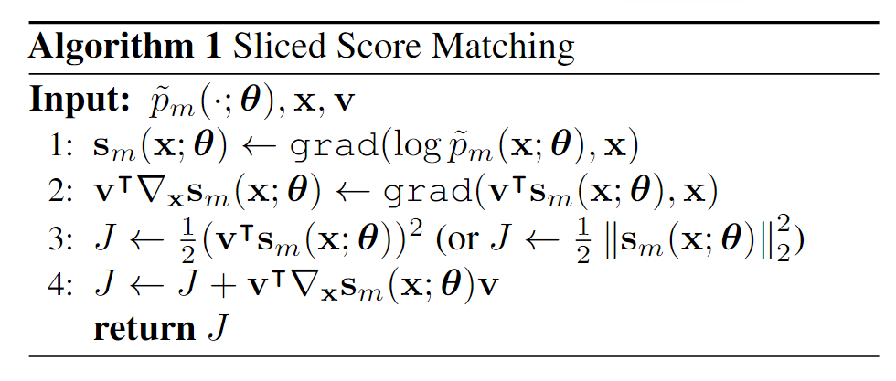
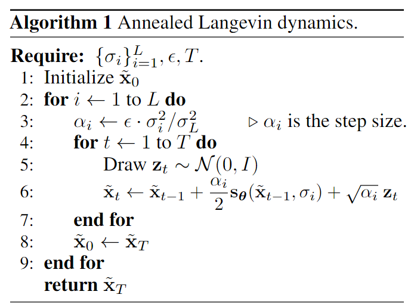

# Score Matching

- [Home](./README.md)

## Energy based model （能量模型）
我们从一个典型的未归一化的的概率模型讲起：能量模型是一种使用能量函数描述样本合乎真实分布的程度，用 $E:\mathbb{R}^{d} \to \mathbb{R}$ 表示，一般来说，能量越低，样本越合乎真实分布。能量函数可以看作是一个未归一化的概率，样本的能量越低，似然越高。具体来说，我们可以用以下公式转换为概率密度：
$$
p(x) = \frac{\exp(-E(x))}{Z},Z=\int_x \exp(-E(x)) dx\,. 
$$

一般来说，我们会用一个网络去建模能量函数，也就是 $E(x;\theta)$，这时候我们有：
$$
p(x;\theta) = \frac{\exp(-E(x;\theta))}{Z(\theta)},Z(\theta)=\int_x \exp(-E(x;\theta)) dx\,. 
$$

那训练自然离不开极大似然估计：
$$
\mathcal{L}_{nll} = \sum_{i} - \log p(x_i;\theta) = \sum_{i} \left(\log \sum_{j} \exp(-E(x_j;\theta)) + E(x_i; \theta) \right)
$$

我们可以看到，其中的第一项需要对整个数据集进行计算，并且为了估计足够准确，采样数量需要足够，这就会使得其计算更加困难。

简单来说，对于一个未归一化的概率模型 $q(x;\theta)$ 来说，我们可以通过归一化得到真正的概率密度：
$$
p(x;\theta) = \frac{1}{Z(\theta)}q(x;\theta), Z(\theta) = \int_x q(x;\theta) dx\,.
$$

而这时想要通过极大似然估计去估计 $\theta$ 将会面临着 $Z(\theta)$ 难以计算的问题。而 score matching 则是想要从另一个角度解决这个问题。

## Score Matching
所谓的 Score Function (记为：$s(x)$ ) 实际上是对数似然对样本的梯度，即
$$
s(x) = \triangledown_x \log p(x)
$$

那么为什么要 score function，一方面大名鼎鼎的 stochastic gradient langevin dynamic (SGLD) 可以通过 score function 从噪声生成真实样本：
$$
x_{t+1} = x_t + \frac{\epsilon}{2}\triangledown_x \log p(x) + \sqrt{\epsilon} z,z\sim \mathcal{N}(0, \mathbf{I})
$$

另一方面，当我们去建模 score function 的时候，即 $s(x;\theta)$，我们可以发现：
$$
s(x;\theta) = \triangledown_x \log p(x;\theta) = \triangledown_x \log q(x;\theta) - \triangledown_x Z(\theta) = \triangledown_x \log q(x;\theta)
$$
这直接避开了难以计算的 $Z(\theta)$ 这一项。

### Explicit Score Matching （显式）
最简单直接明了的做法是直接用网络拟合对数似然的梯度：
$$
J_{ESM}(\theta) =  \mathbb{E}_p \left[\frac{1}{2}\|s(x;\theta) - s(x)\|^2 \right] = \mathbb{E}_p \left[\frac{1}{2}\|s(x;\theta) - \triangledown_x \log p(x)\|^2 \right]
$$
虽然 $s(x;\theta)$ 去除了难以计算的 $Z(\theta)$。但是显然，在没有 $p(x)$ 的解析式前提下，$J_{ESM}(\theta)$ 也是无法计算的，我们仍然无法优化网络结构。

虽然目前不知道如何优化网络，不过我们可以知道的是，假设网络 $s(x;\theta)$ 能力足够，那么其最优解：
$$
\theta^* = \argmin_\theta J_{ESM} (\theta)
$$
应该对于 $x\in\mathbb{R}^d$，几乎处处满足 $s(x;\theta^*)=\triangledown_x\log p(x)$。（对于平方和中的每一项，想要取得最小值0，只有每一项都取0，由于是积分，所以可以存在一些点不满足）

### Implicit Score Matching （隐式）
实际上隐式损失函数是对显示损失函数的一个变换之后的形式，具体推导过程如下：
$$
\begin{align}
J_{ESM}(\theta) &= \mathbb{E}_p \left[\frac{1}{2}\|s(x;\theta) - \triangledown_x \log p(x)\|^2 \right] \nonumber \\
&= \int_x p(x) \left[\frac{1}{2}\|s(x;\theta) - \triangledown_x \log p(x)\|^2 \right] dx \nonumber \\
&= \int_x p(x) \left[\frac{1}{2}(s(x;\theta))^2 + \frac{1}{2}(\triangledown_x \log p(x))^2 - s(x;\theta)^\top\triangledown_x \log p(x) \right] dx \nonumber \\
&= \int_x p(x) \left[\frac{1}{2}(s(x;\theta))^2 - \frac{1}{p(x)}s(x;\theta)^\top\triangledown_x p(x) \right] dx + C_1 \nonumber \\
&= \int_x p(x) \frac{1}{2}(s(x;\theta))^2 dx - \int_x s(x;\theta)^\top\triangledown_x p(x) dx + C_1 \nonumber \\
&= \mathbb{E}_p \left[\frac{1}{2}\|s(x;\theta)\|^2\right] - \int_x s(x;\theta)^\top\triangledown_x p(x) dx + C_1 \nonumber \\
\end{align}
$$

我们需要重点关注的是第二项，继续变换：
$$
\begin{align}
\int_x s(x;\theta)^\top\triangledown_x p(x) dx &= \int_x \sum_i [s(x;\theta)]_i \frac{\partial p(x)}{\partial x_i} dx \nonumber \\
&=  \sum_i \int_{x_{\sim i}} \int_{x_i} [s(x;\theta)]_i \frac{\partial p(x)}{\partial x_i} dx_i dx_{\sim i} \nonumber \\
&=  \sum_i \int_{x_{\sim i}} \underset{\text{assumed to be }0}{\underbrace{[s(x;\theta)]_i p(x)|_{x_i=-\infty}^{\infty}}} - \int_{x_i} p(x) \frac{\partial [s(x;\theta)]_i}{\partial x_i} dx_i dx_{\sim i} \nonumber \\
&=  -  \sum_i \int_{x_{\sim i}} \int_{x_i} p(x) \frac{\partial [s(x;\theta)]_i}{\partial x_i} dx_i dx_{\sim i} \nonumber \\
&=  - \int_{x} p(x) \sum_i\frac{\partial [s(x;\theta)]_i}{\partial x_i} dx \nonumber \\
&=  - \int_{x} p(x) \text{tr}\left[\underset{\text{Hessian}}{\underbrace{\triangledown_x s(x;\theta)}} \right] dx \nonumber \\
&=  - \mathbb{E}_p \left[\text{tr}\left(\underset{\text{Hessian}}{\underbrace{\triangledown_x s(x;\theta)}} \right)\right] \nonumber \\
\end{align}
$$

于是 $J_{ESM}$ 可以转换成：
$$
\begin{align}
J_{ESM}(\theta) &= \mathbb{E}_p \left[\frac{1}{2}\|s(x;\theta)\|^2\right] + \mathbb{E}_p \left[\text{tr}\left({\triangledown_x s(x;\theta)} \right)\right] + C_1 \nonumber \\
&= \mathbb{E}_p \left[\text{tr}\left({\triangledown_x s(x;\theta)} \right) + \frac{1}{2}\|s(x;\theta)\|^2\right] + C_1 \nonumber \\
\end{align}
$$

于是隐式的 score matching 的目标函数被定义为：
$$
J_{ISM}(\theta) = \mathbb{E}_p \left[\text{tr}\left({\triangledown_x s(x;\theta)} \right) + \frac{1}{2}\|s(x;\theta)\|^2\right]
$$
可以看到 $J_{ESM}(\theta) = J_{ISM}(\theta) + C_1$，也就是说优化 $J_{ESM}$ 和 优化$J_{ISM}$ 是等价的。

通过 $J_{ISM}$，我们不需要知道 $p(x)$ 的具体是什么分布，我们就可以优化 $s(x;\theta)$。

值得注意的是，前面的推导过程涉及到了以下几个假设：
- $p(x)$，$s(x;\theta)$ 可微
- $\mathbb{E}_p \left[\|\triangledown_x \log p(x)\|^2\right]$ 有界
- $\forall \theta, \mathbb{E}_p \left[\|s(x;\theta)\|^2\right]$ 有界
- $\lim_{\|x\|\to\infty}p(x)s(x;\theta) = 0$ 

$J_{ISM}(\theta)$ 的采样形式可以表达为：
$$
\hat{J}_{ISM}(\theta) = \frac{1}{N}\sum_{i=1}^N \left[\text{tr}\left({\triangledown_x s(x_i;\theta)} \right) + \frac{1}{2}\|s(x_i;\theta)\|^2\right]
$$

### Slice Score Matching （切片）
虽然 $J_{ISM}$ 提供了一种可行的优化方式，但是注意到其中有一项是计算 Hessian 矩阵（只计算对角线即可），这涉及到需要多次求梯度。当数据维度很高，例如图像，语音等可能成千上万个维度，则需要成千上万次求梯度，这些显然是不合理的。

于是 Song et al. 提出了 SSM，其损失函数被定义为：
$$
J_{SSM}(\theta) = \mathbb{E}_{p_v} \mathbb{E}_{p_x} \left[v^\top{\triangledown_x s(x;\theta)}v + \frac{1}{2}(v^\top s(x;\theta))^2\right]
$$
这时候通过一次梯度回传可计算损失的梯度，具体过程如图：

文章 [Sliced Score Matching: A Scalable Approach to Density and Score Estimation](https://arxiv.org/pdf/1905.07088.pdf) 详细证明了 $J_{SSM}$ 和 $J_{ISM}$ 是等价的。

### Denoising Score Matching （去噪）
DSM 的优化从另一个角度出发，它受到 score matching 和 denoising auto-encoder 的启发：给定 $x\sim p(x)$（分布未知），在给予特定模式的噪声之后得到 $\tilde{x}$，这是我们记 $\tilde{x}$ 的条件概率分布为 $p(\tilde{x}|x)$，$\tilde{x}$ 的真实分布 $p(\tilde{x})=\int_x p(x)p(\tilde{x}|x) dx$ 未知，DSM 的损失函数被定义为：
$$
J_{DSM_{p(\tilde{x})}}(\theta) = \mathbb{E}_{p(x, \tilde{x})}\left[\frac{1}{2}\|s(\tilde{x};\theta) - \triangledown_{\tilde{x}} \log p(\tilde{x}|x) \|^2\right]
$$

下面我们推导 $J_{DSM_{p(\tilde{x})}}$ 等价于 $J_{ESM_{p(\tilde{x})}}$：
$$
\begin{align}
J_{ESM_{p(\tilde{x})}}(\theta) &= \mathbb{E}_{p(\tilde{x})} \left[\frac{1}{2}\|s(\tilde{x},;\theta) - \triangledown_{\tilde{x}} \log p(\tilde{x})\|^2 \right] \nonumber \\
&= \mathbb{E}_{p(\tilde{x})} \left[\frac{1}{2}\|s(\tilde{x};\theta)\|^2 \right] - S(\theta) + C_1 \nonumber \\
S(\theta) &= \mathbb{E}_{p(\tilde{x})}\left[\left<s(\tilde{x};\theta),\triangledown_{\tilde{x}} \log p(\tilde{x})\right>\right] \nonumber \\
&= \int_{\tilde{x}} p(\tilde{x})\left<s(\tilde{x};\theta),\triangledown_{\tilde{x}} \log p(\tilde{x})\right> d\tilde{x} \nonumber \\
&= \int_{\tilde{x}} p(\tilde{x})\left<s(\tilde{x};\theta), \frac{1}{p(\tilde{x})}\triangledown_{\tilde{x}} p(\tilde{x})\right> d\tilde{x} \nonumber \\
&= \int_{\tilde{x}} \left<s(\tilde{x};\theta), \triangledown_{\tilde{x}} p(\tilde{x})\right> d\tilde{x} \nonumber \\
&= \int_{\tilde{x}} \left<s(\tilde{x};\theta), \triangledown_{\tilde{x}} \int_x p(x)p(\tilde{x}|x)dx\right> d\tilde{x} \nonumber \\
&= \int_{\tilde{x}} \left<s(\tilde{x};\theta), \int_x p(x) \triangledown_{\tilde{x}} p(\tilde{x}|x)dx\right> d\tilde{x} \nonumber \\
&= \int_{\tilde{x}} \left<s(\tilde{x};\theta), \int_x p(x) p(\tilde{x}|x) \triangledown_{\tilde{x}} \log p(\tilde{x}|x) dx \right> d\tilde{x} \nonumber \\
&= \int_{\tilde{x}} \int_x p(x) p(\tilde{x}|x) \left<s(\tilde{x};\theta),  \triangledown_{\tilde{x}} \log p(\tilde{x}|x)\right>  dx d\tilde{x} \nonumber \\
&= \mathbb{E}_{p(x, \tilde{x})} \left[\left<s(\tilde{x};\theta),  \triangledown_{\tilde{x}} \log p(\tilde{x}|x)\right>\right] \nonumber \\
\Longleftrightarrow J_{ESM_{p(\tilde{x})}}(\theta) &= \mathbb{E}_{p(\tilde{x})} \left[\frac{1}{2}\|s(\tilde{x};\theta)\|^2 \right] - \mathbb{E}_{p(x, \tilde{x})} \left[\left<s(\tilde{x};\theta),  \triangledown_{\tilde{x}} \log p(\tilde{x}|x)\right>\right]  + C_1 \nonumber \\
J_{DSM_{p(\tilde{x})}}(\theta) &= \mathbb{E}_{p(x, \tilde{x})}\left[\frac{1}{2}\|s(\tilde{x};\theta) - \triangledown_{\tilde{x}} \log p(\tilde{x}|x) \|^2\right] \nonumber \\
&= \mathbb{E}_{p(x, \tilde{x})}\left[\frac{1}{2}\|s(\tilde{x};\theta)\|^2\right] - \mathbb{E}_{p(x, \tilde{x})} \left[\left<s(\tilde{x};\theta),  \triangledown_{\tilde{x}} \log p(\tilde{x}|x)\right>\right] + C_2 \nonumber \\
&= \mathbb{E}_{p(\tilde{x})}\left[\frac{1}{2}\|s(\tilde{x};\theta)\|^2\right] - \mathbb{E}_{p(x, \tilde{x})} \left[\left<s(\tilde{x};\theta),  \triangledown_{\tilde{x}} \log p(\tilde{x}|x)\right>\right] + C_2 \nonumber \\
&= J_{DSM_{p(\tilde{x})}}(\theta) - C_1 + C_2 \nonumber \\
\end{align}
$$
可知，两者等价。也就是说最优解 $\theta^* = \argmin_\theta J_{DSM_{p(\tilde{x})}}(\theta)$，对于 $\tilde{x} \in \mathbb{R}^d$，几乎处处满足 $s(\tilde{x};\theta^*)=\triangledown_{\tilde{x}} \log p(\tilde{x})$。

显然，给与固定模式的噪声，$p(\tilde{x}|x)$ 是可以计算的。通过优化 $J_{DSM_{p(\tilde{x})}}$，在 $p(x)$ 和 $p(\tilde{x})$ 都未知的情况下，我们居然可以估计出 $\triangledown_{\tilde{x}} \log p(\tilde{x})$。

举个栗子：$\tilde{x} = x + \sigma\epsilon, \epsilon \sim \mathcal{N}(0,\mathbf{I})$，显然此时 $p(\tilde{x}|x)=\mathcal{N}(\tilde{x};x,\sigma^2\mathbf{I})$，此时:
$$
J_{DSM}(\theta) = \mathbb{E}_{x,\epsilon} \left[s(x+\sigma\epsilon;\theta) - \triangledown_{\tilde{x}} \log p(\tilde{x}|x)\right] \\
= \mathbb{E}_{x,\epsilon} \left[s(x+\sigma\epsilon;\theta) - \frac{x - \tilde{x}}{\sigma^2}\right] \\
= \mathbb{E}_{x,\epsilon} \left[s(x+\sigma\epsilon;\theta) - \frac{-\epsilon}{\sigma}\right]
$$
可以看到，$\frac{-\epsilon}{\sigma}$ 恰好是去除噪声的方向，这也是为什么称之为 Denoising Score Matching。
优化上述损失，最终得到 $s(\tilde{x};\theta)\approx\triangledown_{\tilde{x}} \log p(\tilde{x})$。（ps：有没有感觉很像 DDPM）

## Noise Conditional Score Network (NCSN)
先介绍基于 Score Function 的生成模型。再提 Stochastic Gradient Langevin Dynamic (SGLD)，在 Score Function 已知的情况下，我们可以通过以下的迭代式从一个随机噪声生成样本：
$$
x_{t+1} = x_t + \frac{\epsilon}{2}\triangledown_x \log p(x) + \sqrt{\epsilon} z_t, z_t \sim \mathcal{N}(0, \mathbf{I})
$$

通过前面介绍的估计 Score Matching 方法，我们可以估计 $\triangledown_x \log p(x)$。

但是无论是 ESM，ISM，SSM，DSM 都会面领着以下几个问题：
- 流形假设：现实世界中的数据往往集中在嵌入在高维空间（即环境空间）中的低维流形上。
- - $\triangledown_x \log p(x)$ 在低维流形之外是未定义的。
- - Score Matching 目标方程仅当数据分布的支撑是整个空间时才提供一致的Score Function Estimator，当数据驻留在低维流形上时，将不一致。
- 低密度区域的数据稀缺可能会导致 分数估计、分数匹配 和 使用朗之万动力学采样 困难。
- - Score Matching 在低密度区域不准确。
- - Langevin Dynamics 无法区分分布的混合，详细见 [section 3.2.2](https://arxiv.org/pdf/1907.05600.pdf)。

总的来说，直接使用 Score Matching 然后采用 Langevin Dynamic 进行采样，作为生成模型还是会遇到一些问题。

NCSN 采用的思想是：通过给原始数据分布加入从小到大的高斯噪声，形成从低维流形到充满整个空间的不同的加噪数据分布。接着采用 Langevin Dynamic 从噪声大的分布慢慢生成噪声小的数据分布。

具体来说，给定一个序列 $\{\sigma_i\}_{i=1}^L$，满足 $\frac{\sigma_1}{\sigma_2}=\frac{\sigma_2}{\sigma_3}=\cdots=\frac{\sigma_{L-1}}{\sigma_L}>1$。

给定 $\sigma$，$\tilde{x} = x + \sigma\epsilon, \epsilon\sim\mathcal{N}(0,\mathbf{I})$。记 $\tilde{x}$ 的数据分布为 $p_{\sigma}(\tilde{x}) = \int_x p(x)p(\tilde{x}|x)dx$，易知 $p(\tilde{x}|x) = \mathcal{N}(\tilde{x};x,\sigma^2\mathbf{I})$。
通过前面介绍的 DSM，我们可以估计到所有的 $\triangledown_{\tilde{x}} \log p_{\sigma_i}(\tilde{x})$。通过 Langevin Dynamic，我们可以生成来自 $p_{\sigma_i}(\tilde{x})$ 的样本。

于是我们可以采取以下策略：
- $\sigma_1$ 足够大，以至于数据分布可以充满整个高维空间，解决前面提到的问题
- $\sigma_L$ 足够小，这样 $p_{\sigma_L}(\tilde{x})$ 可以近似为 $p(x)$。
- 逐步从 $p_{\sigma_1}(\tilde{x})$ 到 $p_{\sigma_L}(\tilde{x})$ 生成样本，相当于采用 $L$ 次 SGLD，最终得到 $p_{\sigma_L}(\tilde{x})$ 的样本，近似真实 $p(x)$ 的样本。

我们采用 $s(x,\sigma;\theta)$ 去估计 $\triangledown_{\tilde{x}} \log p_{\sigma}(\tilde{x})$，训练的目标函数如下：
$$
\ell(\theta;\sigma)=\mathbb{E}_{p(x)}\mathbb{E}_{\tilde{x}\sim\mathcal{N}(x,\sigma^2\mathbf{I})} \left[\frac12\left\|s(\tilde{x},\sigma;\theta)-\triangledown_{\tilde{x}} \log p(\tilde{x}|x)\right\|^2\right] \\
=\mathbb{E}_{p(x)}\mathbb{E}_{\tilde{x}\sim\mathcal{N}(x,\sigma^2\mathbf{I})} \left[\frac12\left\|s(\tilde{x},\sigma;\theta)+\frac{\tilde{x}-x}{\sigma^2}\right\|^2\right]
$$

总的训练损失为：
$$
L(\theta) = \frac1L \sum_{i=1}^L \lambda(\sigma_i)\ell(\theta;\sigma_i)
$$

假定 $s(\tilde{x},\sigma;\theta)$ 能力足够。最优解对 $\tilde{x}\in\mathbb{R}^d$ 几乎处处满足 $s(\tilde{x},\sigma;\theta^*) = \triangledown_{\tilde{x}} \log p_{\sigma}(\tilde{x})$。

优化目标中的 $\lambda(\sigma_i)$ 是希望对于所有的 $\sigma_i$，$\lambda(\sigma_i)\ell(\theta;\sigma_i)$ 都能够在同一数量级，而观察到对于最优解一般 $\|s(\tilde{x},\sigma;\theta)\|_2 \propto \frac1\sigma$，于是我们选择 $\lambda(\sigma_i) = \sigma_i^2$，这时候有 $\lambda(\sigma_i)\ell(\theta;\sigma_i)=\mathbb{E} \left[\frac12\left\|\sigma_i s(\tilde{x},\sigma_i;\theta)+\frac{\tilde{x}-x}{\sigma_i}\right\|^2\right]$，这时候 $\|\sigma_i s(\tilde{x},\sigma_i;\theta)\| \propto 1, \|\frac{\tilde{x}-x}{\sigma_i}\|\propto 1$，对于所有的 $\sigma_i$，$\lambda(\sigma_i)\ell(\theta;\sigma_i)$ 都能够处于同一数量级。

对于采样的过程，按照我们前面提到的方式进行采样：

### Connection with DDPM
在 DDPM 的前向过程中，我们知道：
$$
x_{t} = \sqrt{\bar{\alpha}_t}x_0+\sqrt{1-\bar{\alpha}_t}\epsilon, \epsilon \sim \mathcal{N}(0,\mathbf{I})
$$
我们也可用基于 DSM 的方式去建模 $\triangledown_{x_{t}}\log p(x_{t}|x_0)$，其损失函数为：
$$
\mathcal{L} = \mathbb{E}_{t\sim U(1, T)}\mathbb{E}_{x_0 \sim q_0(x_0)}\mathbb{E}_{x_t\sim q(x_t| x)} \lambda(t) \|s(x_t,t) - \triangledown_{x_{t}}\log p(x_{t}|x_0)\|^2
$$

根据前面的重参数化技巧我们知道：
$$
\triangledown_{x_{t}}\log p(x_{t}|x_0) = - \triangledown_{x_{t}} \frac{(x_t - \sqrt{\bar{\alpha}_t}x_0)^2}{2 (1-\bar{\alpha}_t)} = - \frac{\epsilon}{\sqrt{1-\bar{\alpha}_t}}
$$

损失函数变为：
$$
\mathcal{L} = \mathbb{E}_{t\sim U(1, T)}\mathbb{E}_{x_0 \sim q_0(x_0)}\mathbb{E}_{\epsilon\sim \mathcal{N}(0,\mathbf{I})} \lambda(t)\Big\|[-s(\sqrt{\bar{\alpha}_t}x_0+\sqrt{1-\bar{\alpha}_t}\epsilon,t)] - \frac{\epsilon}{\sqrt{1-\bar{\alpha}_t}}\Big\|^2 \\
= \mathbb{E}_{t\sim U(1, T)}\mathbb{E}_{x_0 \sim q_0(x_0)}\mathbb{E}_{\epsilon\sim \mathcal{N}(0,\mathbf{I})} \frac{\lambda(t)}{1-\bar{\alpha}_t} \Big\|[-\sqrt{1-\bar{\alpha}_t}s(\sqrt{\bar{\alpha}_t}x_0+\sqrt{1-\bar{\alpha}_t}\epsilon,t)] - \epsilon \Big\|^2
$$

取 $\lambda(t) = 1-\bar{\alpha}_t$，有：
$$
\mathcal{L} = \mathbb{E}_{t\sim U(1, T)}\mathbb{E}_{x_0 \sim q_0(x_0)}\mathbb{E}_{\epsilon\sim \mathcal{N}(0,\mathbf{I})} \Big\|[-\sqrt{1-\bar{\alpha}_t}s(\sqrt{\bar{\alpha}_t}x_0+\sqrt{1-\bar{\alpha}_t}\epsilon,t)] - \epsilon \Big\|^2
$$

观察 DDPM 原始简化训练目标我们有：
$$
s(x,t) = -\frac{\epsilon(x,t)}{\sqrt{1-\bar{\alpha}_t}}
$$

也就是说：DDPM 中学习的噪声网络实际上就是在做 Denoising Score Matching。
